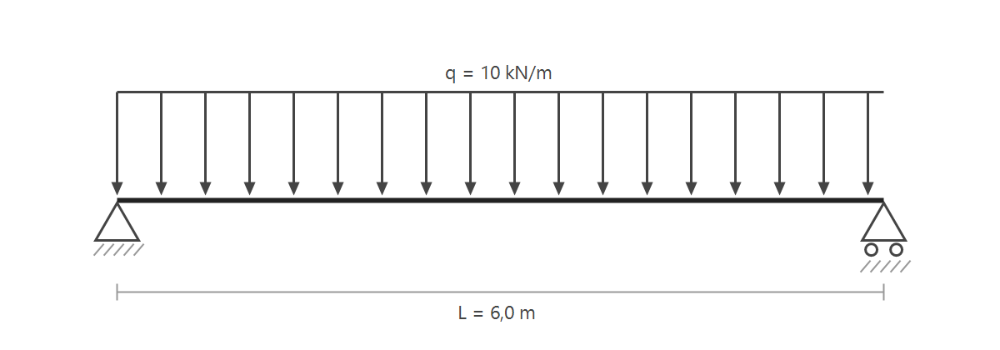

<nav style="text-align:right;font-size:0.85em"><a href="index.html">Čeština</a> · <a href="en.html">English</a> · <a href="de.html">Deutsch</a></nav>

## Warum Mikrotypografie

Rohes Markdown liefert gerade Anführungszeichen, Bindestriche statt
Gedankenstriche und keine Kontrolle über Zeilenumbrüche - mdprint korrigiert
das beim Erzeugen der Seite. Diese Seite entstand mit
`mdprint --toc --lang de` aus einer reinen Textdatei.

## Was der deutsche Modus leistet

Die Regeln folgen DIN 5008: "Gänsefüßchen" werden automatisch gesetzt,
Abkürzungen wie z. B., d. h. oder i. d. R. erhalten geschützte Leerzeichen,
Verweise wie Nr. 5, S. 12 oder Abb. 1 bleiben mit ihrer Zahl verbunden.
Zahl und Einheit - etwa 10 kN, 25 °C oder 230 V - trennt kein Umbruch,
Bereiche wie 10-20 kN oder die Jahre 1990-2026 bekommen einen Bis-Strich,
Abmessungen wie 40x60 mm ein echtes Malzeichen und 1 000 000 Zyklen ein
schmales geschütztes Leerzeichen. Auch die Silbentrennung spricht Deutsch:
Donaudampfschifffahrtsgesellschaftskapitänsmützenabzeichen bricht sauber um,
und geht's um Apostrophe, sitzt auch der richtig.

## Mathematik

Die maximale Durchbiegung eines Einfeldträgers unter Gleichlast beträgt

$$w_{\max} = \frac{5\,q\,L^4}{384\,E\,I},$$

wobei $E$ der Elastizitätsmodul und $I$ das Flächenträgheitsmoment ist.
Für Stahl gilt $E = 210\,\mathrm{GPa}$; die Norm begrenzt die bezogene
Durchbiegung $w_{\max}/L$ üblicherweise auf 1/250. Das statische System
zeigt Abb. 1.



## Quelltext vs. Ergebnis

Der folgende Block ist der wörtliche Quelltext des Absatzes darunter:

```markdown
Er sagte "die Spannweite beträgt 6 m" - d. h. auf S. 12 steht ein
Querschnitt 40x60 mm, geprüft am 1. 10. 2026 bei 25 °C... Vgl. Nr. 5.
```

Er sagte "die Spannweite beträgt 6 m" - d. h. auf S. 12 steht ein
Querschnitt 40x60 mm, geprüft am 1. 10. 2026 bei 25 °C... Vgl. Nr. 5.

Anführungszeichen, Gedankenstrich, geschützte Leerzeichen in Abkürzung,
Datum und Einheit, Malzeichen und Auslassungspunkte - alles automatisch.
